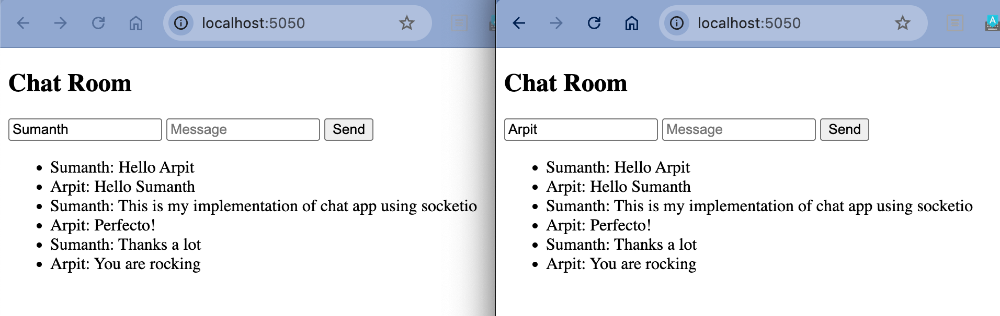
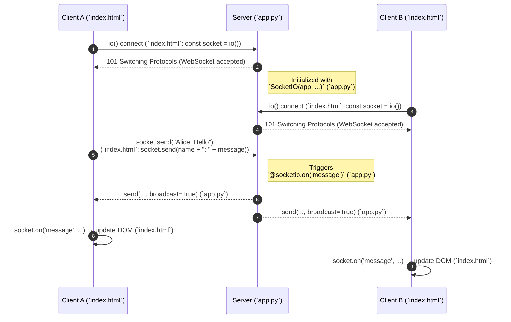

# SocketIO chat app

```bash
docker compose up --build
```

Open two tabs with <http:localhost:5050>

## Screenshot



## Code flow


```mermaid
sequenceDiagram
    autonumber

    participant A as Client A (`index.html`)
    participant S as Server (`app.py`)
    participant B as Client B (`index.html`)

    %% Phase 1: Client A connects
    A->>S: io() connect (`index.html`: const socket = io())
    S-->>A: 101 Switching Protocols (WebSocket accepted)
    Note right of S: Initialized with<br/>`SocketIO(app, ...)` (`app.py`)

    %% Phase 2: Client B connects
    B->>S: io() connect (`index.html`: const socket = io())
    S-->>B: 101 Switching Protocols (WebSocket accepted)

    %% Phase 3: Client A sends message
    A->>S: socket.send("Alice: Hello")<br/>(`index.html`: socket.send(name + ": " + message))
    Note right of S: Triggers<br/>`@socketio.on('message')` (`app.py`)

    %% Phase 4: Server broadcasts
    S-->>A: send(..., broadcast=True) (`app.py`)
    S-->>B: send(..., broadcast=True) (`app.py`)

    %% Phase 5: Clients receive and render
    A->>A: socket.on('message', ...) → update DOM (`index.html`)
    B->>B: socket.on('message', ...) → update DOM (`index.html`)
```
